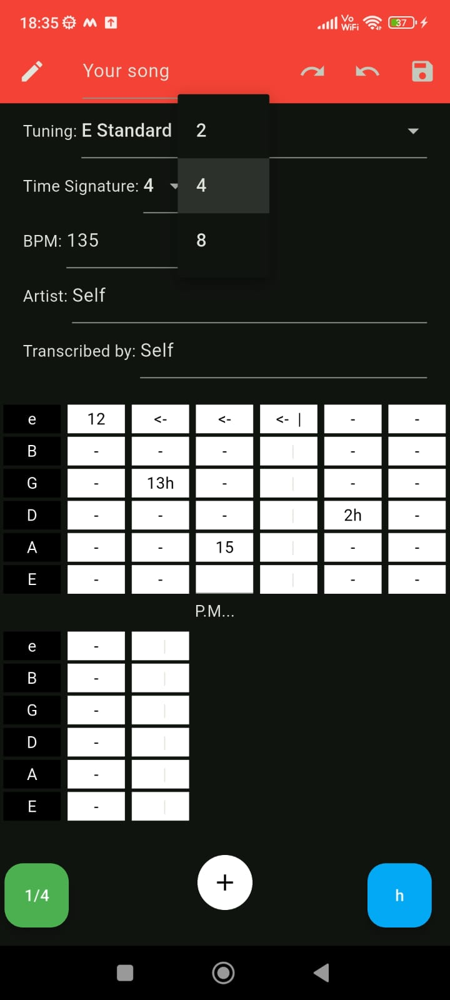
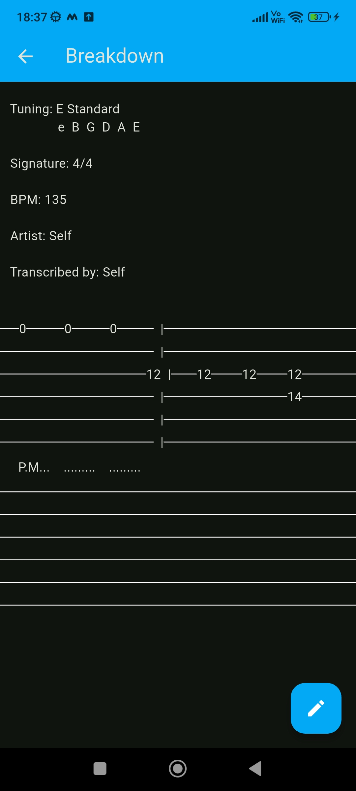
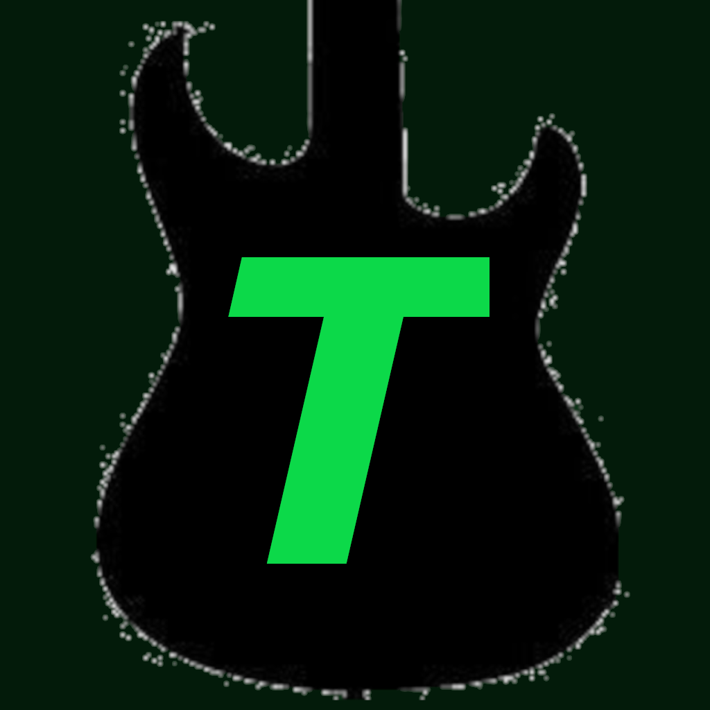

# Tabsy

A CRUD(Create Read Update Delete) application for guitar Tablatures.

## Features

- Create, Read, Update and Delete operations for tabs
- Support undo and redo stack operations
- Grid based editor where only one cell can be edited at a time
- Real time editing where changes by the user are shown immediately
- Buttons to change duration and effect of selected note, which
retains the previous selection by user
- Since notes can span multiple beats, they are only represented
by one cell contatining the fret number and effect followed by
cells with "<-". Clicking on them takes us to the fret with the content

## Pictures






## Current Limitations

- Currently, only hammer-on, pull-of, vibrato 
and palm muting are present as effects.
- Currently, only whole, half and quarter notes
are allowed in duration
- Only two tuning are available
- Only fixed values for timsSignature are availabe

## Future features

- Add a dialog box when the user tries to exit
editing with unsaved changes
- Add support for other effect, duration
- Add more tunings and include the option to
create and save a custom tuning
- Allow any value for numerator of time signature
- Switch to SQL for database and allow sorting
tabs or storing them into folders
- Include a feature which makes putting tapping
easier

## Running the Project

### Prerequisites

- Flutter SDK
- Android Studio or VS Code
- An Android emulator or a physical Android device

### Installation

1. Clone the repository:

```bash
git clone <repository-url>
cd tabsy
```

2. Install dependencies:

```bash
flutter pub get
```

3. Run the application:

Either open an emulator or connect your phone to your computer
with USB debugging on. 

In case you are using your phone and don't have USB debuggin on,
[follow this](https://techengage.com/enable-usb-debugging-mode-on-android/)

```bash
flutter run
```

## Tech Stack

- Dart as the programming language
- Flutter as the UI framework
- VS Code for writing code
- Android Studio for Android building tools
- Hive for storage
- GIMP for creating the icon

## What is a Guitar Tablature?

Guitar Tablature or simply tabs are a visual representation of
a song which allows musicians to communicate their musical ideas
to others. Unlike sheet music, tabs are built specifically for 
guitarists. 

## Why I built it

It all started when my guitar teacher asked me to write down tabs
for my own reference. Even though, he meant for me to write it down
on paper, I wondered if there was an app for it. I decided to make
one myself so I can mix my two biggest interests - guitar and coding.

## the data structure

Tabs are fundamentally stored as 2D list of notes. Each note stores the
fret number along with the effect applied on it and its duration. Since, 
a song can have rests(absence of notes) we store them as notes with
an invalid fret number, -1 in our case.

If you are not familiar with frets, the neck of a guitar is divided into multiple
regions by metal bars. These regions are called fret and when a string is hit
while the guitarist holds said string at any fret, we get a specific note.
The fret number is the position of the fret on the neck. The positions
are indexed from 1, with 0 representing that no fret should be held while
the string is hit(called hittng a open string).

Effect have a fixed set of values to
choose from. Duration, in pratice, is chosen from a set of standard values.
Hence, it is natural for both these fields to be enums;

Duration of a note is denoted with respect to a whole note. The duration
can be either whole note or a division of it. Generally, other than whole 
note, you will see quarter notes, half notes. eight notes and one-third quarter 
note(triplets). In some niche genres, you can even find sixteenth notes
and one-fifth quarter note(quintuplets). I have personally never seen any
duration other than this. I store all these possibilites as values of an enum 
which holds a number which we will use later. I wanted this number to an integer,
so I took the LCM of 1,2,4,8,16,12,20 - 240 - as the value of whole note and the
number for other durations are calculated based on this reference. For example,
half note is 240/2 = 120;

## The reasoning behing the data structure

Any song is composed of notes. Guitar Tabs start simple by just telling you which
note to play and when to play it. However, the problem is that a single
note can be played with one of many effects on a guitar(especially on electric guitar).
To cover all of them, there are many extra rules and symbols added. For a quick
tutorial for tabs [click here](https://musescore.com/articles/materials/guitar/how-to-read-guitar-tabs).
If you want to see all of the effects and their representation, 
[click here](https://www.songsterr.com/howtoreadtab)

Keeping the complexity of tabs in mind, it would be optimal to break them
into simpler parts and then use those parts to build the tabs in the user
interface. Afterall, tabs are just a way to represent a song. A song itself
can be divided into either notes or beats. A beat is just a unit of time used 
to measure how long a song is. They have an advantage over note, in that a
tab is always written in terms of beats. However, the problem is that a single
note can span multiple beats and not all notes have the same number of beats. 
So, changing the duration of a note of a beat in the middle will cause us to 
change all the subsequent beats. This shows that notes are more fundamental
to a song making them fit to be the source of truth.

## The User Interface

The user interface is definitely the most challenging part of this app.
The problem is that as discussed earlier, note need to stored as the 
source of truth. However, a tab is shown based on beats. To overcome
this limitation, we create a list of beats for the tab which is to be
shown. To understand these calculations, you need to be aware of the
concept of Time Signature which connects the duration of a note to
number of beats a note will last. To understand Time Signature,
you can [click here](https://hellomusictheory.com/learn/time-signatures/)